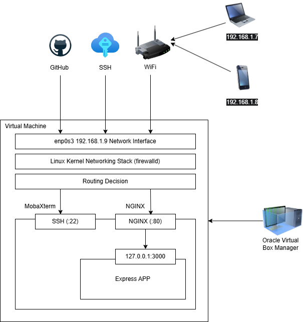

# linux-web-server-deployment

A practical, hands-on guide to deploying and hosting a Node.js web application on Linux using industry-standard tools such as **NGINX**, **systemd**, **firewalld**, **Git**, and **SSH**.

## Why this repository?

Ever wondered what actually happens after you finish writing your web application?

How does it go from running on your laptop to being hosted on a Linux server that users can access over a network?

This repository walks you through that entire journey.

Instead of simply giving you commands to copy and paste, the goal is to help you understand **why** each step is performed, so that you can confidently deploy your own applications in the future.

Throughout this guide, you'll learn how to:

- Set up a Linux application server.
- Configure networking and SSH access.
- Install the required software packages.
- Clone and run a Node.js application.
- Manage the application using **systemd**.
- Configure **firewalld**.
- Set up **NGINX** as a reverse proxy.
- Verify the deployment from other devices on your network.

By the end, you'll have a solid understanding of how a production-style Linux web server is configured.

---

## 🏗️ Deployment Architecture

The following diagram provides a high-level overview of the deployment architecture you'll build throughout this guide.

It illustrates how a client request travels from a web browser to your Linux server, through **NGINX**, and finally reaches the **Node.js (Express)** application managed by **systemd**.

> **Architecture Diagram**



By the end of this guide, you'll understand how each component in this architecture works together to host a production-style web application.

## About this guide

The purpose of this repository is to share the knowledge I gained while learning Linux server administration and web application deployment.

Whether you're a student, a beginner exploring Linux, or someone looking to understand how applications are hosted in the real world, I hope this guide helps you learn something new.

You're also welcome to use this repository as additional context for AI tools and LLMs while working on similar deployments.

If you find anything that could be improved, notice an error, or have suggestions, I'd genuinely appreciate your feedback.

---

## Prerequisites

You don't need to be a Linux expert to follow this guide.

A basic understanding of Linux commands is enough to get started.

There is one recommendation, though:

> **Use a stable Wi-Fi connection.**

Towards the end of the guide, we'll verify that the deployed application can be accessed from other devices (such as your phone) connected to the same network.

---

## Repository Structure

```
commands/         Step-by-step deployment guide
troubleshooting/  Solutions to common issues
images/           Screenshots used throughout the documentation
```

Whenever there's a possibility of running into a common issue, I've included links to the relevant troubleshooting guide.

---

## ▶️ Getting Started

Start from the **`commands`** directory.

The files are numbered in the order they should be followed.

**It's recommended not to skip any steps**, as each section builds upon the previous one.

If you encounter any issues, check the corresponding guide inside the **`troubleshooting`** directory.

### Start here → [01 - Virtual Machine Configuration](commands/01-vm-config.md)

---

## ⭐ If this repository helped you...

If you found this guide useful, consider giving the repository a ⭐.

It motivates me to create more practical, beginner-friendly resources for the developer community.

Happy learning!

---

## License

This repository is provided for educational purposes. Feel free to use and adapt the content for your own learning.
