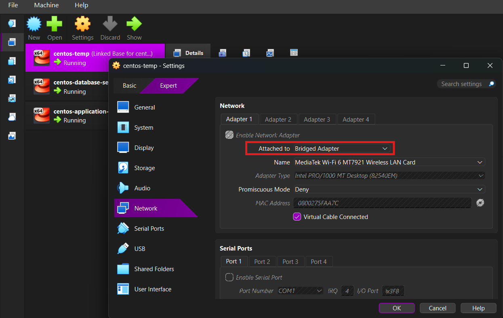
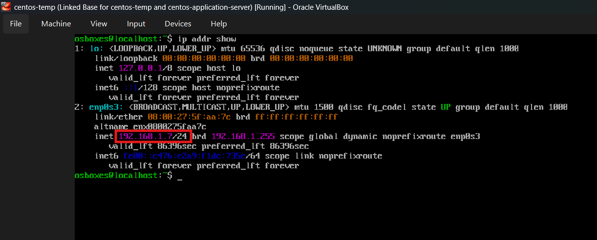

# Virtual Machine Setup

> **Please read this section completely before you begin.**

This project assumes that you already have a working CentOS virtual machine. It does **not** cover VirtualBox installation or virtual machine setup in detail.

If you encounter any issues while installing or configuring your VM, please resolve them before proceeding with the rest of this guide. To help you get started, I've included the resources that I used during my setup.

## Environment

- **Oracle VM VirtualBox Version:** 7.2.12 

## Helpful Resources

### Install Oracle VM VirtualBox

- **Windows Installation Guide**
  - https://youtu.be/homRENM8KVY?si=E8vw2GlB3aIQZOsi

### Load a CentOS VMDK File

- **Video Tutorial**
  - https://youtu.be/DSBfX20HB28?si=4qaUrfApxnhrwErh

### Detailed ChatGPT Guide

- https://chatgpt.com/share/6a56792b-84d8-83e8-8554-af9b0388e575
Ask follow up questions if you face any issues.
---

# Creating the Virtual Machine

Once VirtualBox is installed, you can either:

- **Clone an existing virtual machine**, or
- **Create a new virtual machine** using the downloaded VMDK file.

---

# Configure the Network Adapter

Before starting the virtual machine, verify the following configuration:

```
Settings
└── Network
    └── Adapter 1
        └── Attached to: Bridged Adapter
```


## Why Bridged Adapter?

There are two commonly used networking modes in VirtualBox.

### Bridged Networking (Recommended)

- The virtual machine connects directly to the same network as your physical computer.
- It receives its own IP address from your router (via DHCP).
- The VM appears as a separate device on your local network.
- Other devices on the same network can communicate directly with it.

### NAT Networking

- The virtual machine shares your host computer's internet connection.
- The VM is hidden behind the host machine.
- Other devices on the network cannot directly access the VM without additional configuration.

> **This project requires the VM to act as an Application Server**, so **Bridged Adapter** is the recommended networking mode.

---

# Start the Virtual Machine

Once the networking configuration is complete, power on the virtual machine.

---

# Verify Network Connectivity

Inside the CentOS VM, run:

```bash
ip addr show
```



You should see a network interface (for example, `enp0s3`) with an assigned IP address.

Example:

```text
inet 192.168.1.7/24
```

In most cases, your Wi-Fi router automatically assigns an IP address using DHCP.

---

## No IP Address Assigned?

If your network interface does **not** have an IP address, refer to:
[No IP Address Guide](../troubleshooting/no-ip-address.md).

Resolve the issue before continuing.

---

# Verify Connectivity from Your Host Machine

Once your VM has an IP address, verify that it is reachable from your Windows machine.

Open **Command Prompt** and run:

```cmd
ping <vm-ip-address>
```

Example:

```cmd
ping 192.168.1.7
```

Expected output:

```text
Pinging 192.168.1.7 with 32 bytes of data:
Reply from 192.168.1.7: bytes=32 time=2ms TTL=64
Reply from 192.168.1.7: bytes=32 time=4ms TTL=64
Reply from 192.168.1.7: bytes=32 time=1ms TTL=64
Reply from 192.168.1.7: bytes=32 time=1ms TTL=64

Ping statistics for 192.168.1.7:
    Packets: Sent = 4
    Received = 4
    Lost = 0 (0% loss)

Approximate round trip times:
    Minimum = 1ms
    Maximum = 4ms
    Average = 2ms
```

Receiving successful replies confirms that:

- Your VM is connected to the network.
- The VM is reachable from other devices on the same Wi-Fi network.
- The network configuration has been completed successfully.

---

## Next Step

Awesome! Your virtual machine is now accessible over the network.

You are now ready to proceed with **SSH setup and MobaXterm SSH connections**.