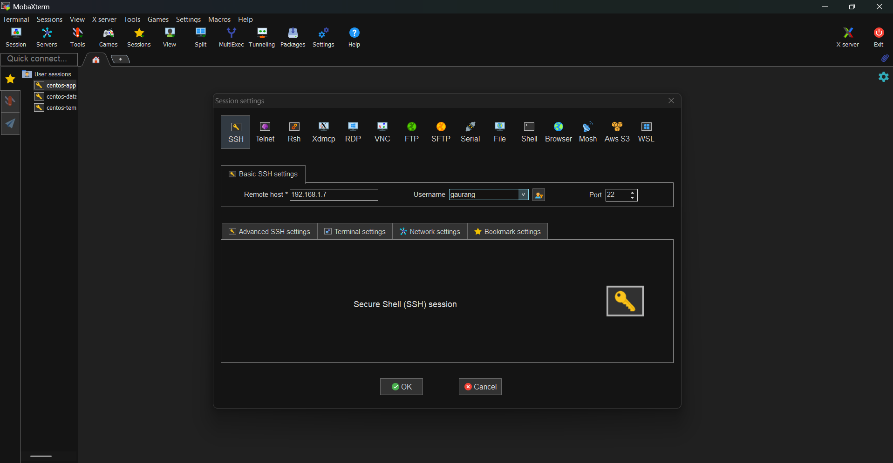

# SSH Setup with MobaXterm

> **This guide assumes that your virtual machine is already running and accessible over the network.** If you haven't completed the VM setup yet, please finish that section before proceeding.

## What is SSH?

**SSH (Secure Shell)** is a cryptographic network protocol that enables secure communication between two computers over an unsecured network, such as the internet or a local network.

It allows you to remotely log in to a Linux machine, execute commands, transfer files, and manage the server securely.

## Why Use SSH?

In a typical Linux environment, administrators rarely work directly on the server's physical console.

Instead, they connect to the server remotely using **SSH (Secure Shell)**. This allows you to securely access and manage the server from your own computer, regardless of where the server is physically located.

In real-world environments:

- Servers are often hosted in data centers or cloud environments.
- Administrators connect remotely using SSH.
- All server configuration, deployment, and maintenance are performed over these remote connections.

Throughout this project, we'll follow the same workflow.

---

## Ensure the SSH Service Is Running

Before attempting to connect using MobaXterm, verify that the **SSH server (`sshd`)** is running on your virtual machine.

### Verify the SSH Service

Run the following command on your CentOS virtual machine:

```bash
systemctl status sshd
```

You should see output similar to:

```text
● sshd.service - OpenSSH server daemon
   Loaded: loaded (...)
   Active: active (running)
```

The important part is:

```text
Active: active (running)
```

This confirms that the SSH server is running and ready to accept incoming SSH connections.

> **Note:** If the `sshd` service is not running, MobaXterm (or any other SSH client) will not be able to connect to the virtual machine.

Once you've confirmed that the service is running, you're ready to establish an SSH connection.

---

## About MobaXterm

**MobaXterm** is a powerful, all-in-one terminal and remote computing application for Windows. It provides an intuitive interface for establishing SSH connections and managing Linux servers from your local machine.

This guide does **not** cover the installation of MobaXterm in detail. If you need help installing it, the following resource is a great place to start.

### Installation Resource

- **How to Install MobaXterm**
  - https://youtu.be/bmuMiUh-Kuo?si=5I9XytrojC7GjBLd

---

## Create a New SSH Session

Once MobaXterm has been installed:

1. Launch **MobaXterm**.
2. Click **Session**.
3. Select **SSH**.
4. Create a new SSH session.

You'll be prompted to enter the connection details.

- **Remote Host:** Enter the IP address of your virtual machine.
- **Username:** Enter the Linux username if you know it. Otherwise, leave this field blank and provide the username when prompted during login.

### Example



---

## Next Step

Once the SSH session has been created successfully, connect to the virtual machine and log in using your Linux credentials.

From this point onward, all server configuration and application deployment will be performed through this SSH session.

Perfect! You've successfully established an SSH connection to your virtual machine. You're now ready to move on to the next section.