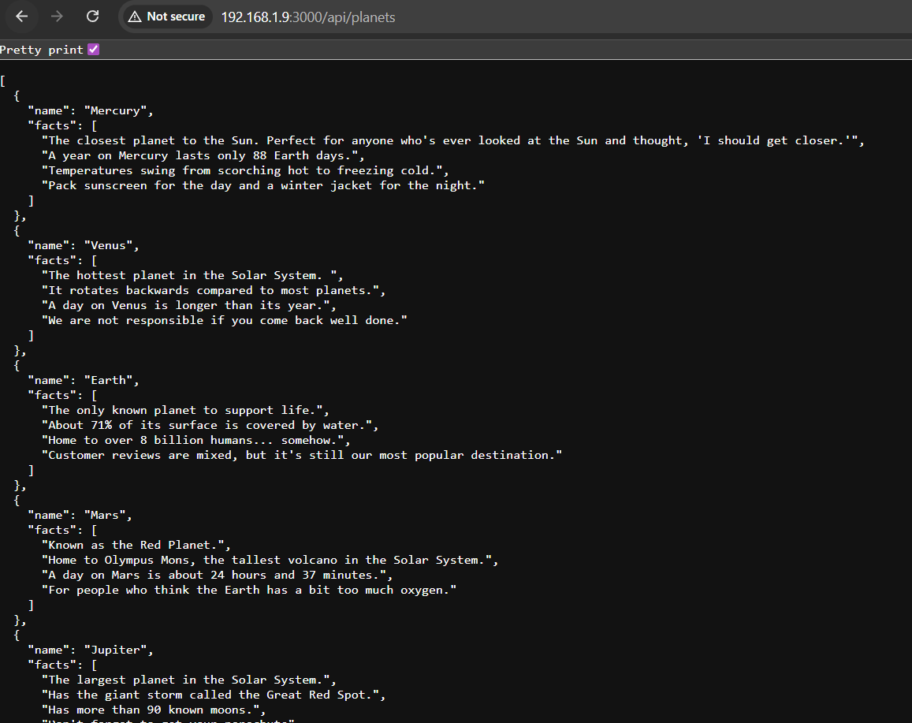

# Run the Application Over the Network

So far, we've verified that the application can run successfully in a local development environment.

The next step is to make the application accessible over the network so that other devices on the same WiFi can send requests to it.

To achieve this, we'll:

- Switch the application to **production** mode.
- Configure it to listen on all available network interfaces.
- Allow incoming traffic on **port 3000** through the firewall.

---

## Update the Environment Configuration

Open the `.env` file:

```bash
sudo vi .env
```

Update it as follows:

```env
ENV=production
DEV_HOST=localhost
PROD_HOST=0.0.0.0
PORT=3000
```

Save and exit the editor using:

```text
:wq
```

### Why are we making this change?

By setting:

```text
ENV=production
```

the application will use the value of `PROD_HOST` instead of `DEV_HOST`.

The address:

```text
0.0.0.0
```

instructs Express to listen on **all available network interfaces**, allowing devices on the network to access the application.

---

## Verify the Firewall Service

Before the application can accept incoming connections, ensure that the firewall service is running.

```bash
systemctl status firewalld
```

You should see:

```text
Active: active (running)
```

---

## Check the Current Firewall Configuration

View the active firewall configuration:

```bash
sudo firewall-cmd --list-all
```

Initially, you'll likely notice something similar to:

```text
ports:
```

which means no custom ports have been opened yet.

---

## Open Port 3000

Allow incoming TCP traffic on port **3000**:

```bash
sudo firewall-cmd --add-port=3000/tcp
```

If the command succeeds, you'll see:

```text
success
```
Reload the firewall configuration:

```bash
sudo firewall-cmd --reload
```

Verify the firewall configuration again:

```bash
sudo firewall-cmd --list-all
```

You should now see:

```text
ports: 3000/tcp
```

This confirms that the firewall is now allowing incoming connections on port **3000**.

---

## Start the Application

Start the application:

```bash
npm start
```

If everything has been configured correctly, the application should now be listening on:

```text
0.0.0.0:3000
```

which makes it accessible from other devices on the same network.

---

## Verify the Application

From your **Windows Command Prompt**, send a request to the application using the VM's IP address.

```bash
curl http://<VM-IP>:3000/api/planets
```

Example:

```bash
curl http://192.168.1.9:3000/api/planets
```

If the request is successful, you should receive a JSON response containing the list of planets.



---

## What's Next?

Congratulations! Your application is now running outside of the local environment and is accessible over the network.

In the next section, we will create a service account to run this application before we create a systemd file to manage this service.