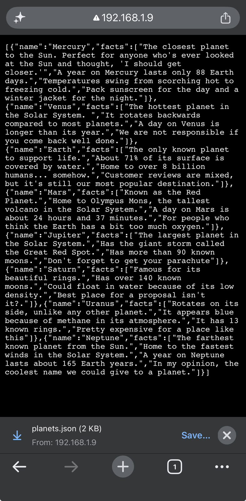
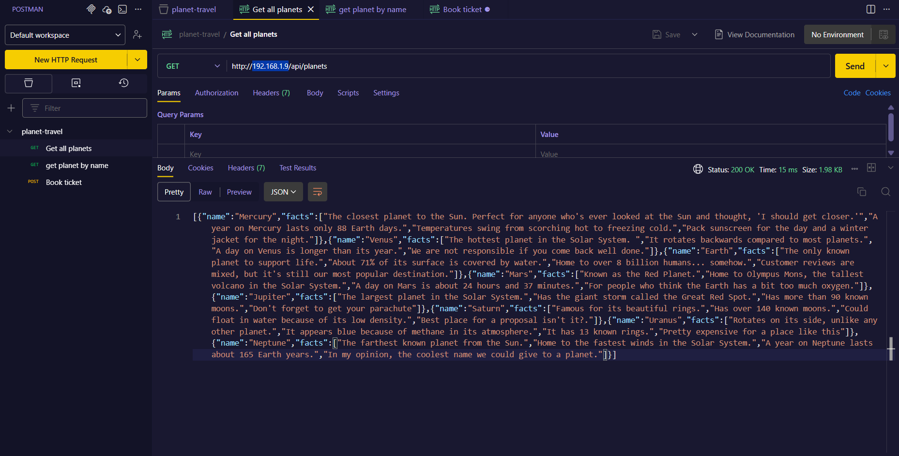
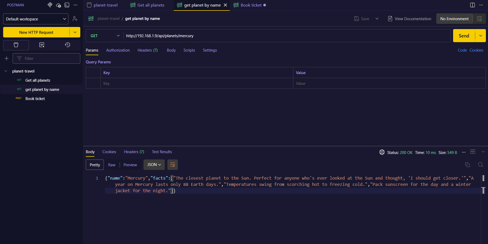
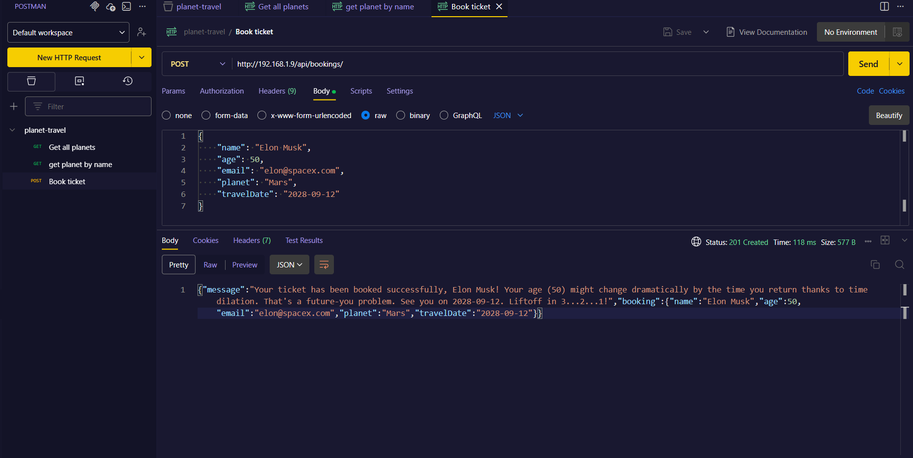

# Verify the Deployment

If you encountered any issues while configuring NGINX, don't worry.

Refer to the troubleshooting guide for solutions to some of the most common configuration problems: [NGINX Configuration Troubleshooting](../troubleshooting/nginx-warning-fix.md)

Once you've resolved any issues, continue with the verification steps below.

---

## Verify the Application

At this point, your Express application should be accessible through **NGINX** on the default HTTP port (**80**).

From your **Windows Command Prompt**, run:

```bash
curl http://<VM-IP>/api/planets
```

Example:

```bash
curl http://192.168.1.9/api/planets
```

If everything has been configured correctly, you should receive a JSON response from the application.

---

## Verify Using a Web Browser

You can also open the application endpoint from any device connected to the same Wi-Fi network.

For example, on your phone, visit:

```text
http://<VM-IP>/api/planets
```

Example output:



This confirms that:

- NGINX is successfully receiving HTTP requests on port **80**.
- Requests are being forwarded to the Express application.
- The application is accessible from other devices on the local network.

---

## Verify Using Postman

If you prefer testing APIs with Postman, the following screenshots show successful responses from the deployed application.

### Get All Planets



### Get Planet by ID



### Create a Booking



---

# Congratulations! 

You've successfully deployed a production-style Node.js application on a Linux server.

Throughout this guide, you learned how to:

- Set up and configure a Linux virtual machine.
- Access the server securely using SSH.
- Install the required software packages.
- Clone and configure a Node.js application.
- Manage the application using a dedicated **systemd** service.
- Create a dedicated **service account** following security best practices.
- Configure the Linux firewall.
- Install and configure **NGINX** as a reverse proxy.
- Expose the application over the network.
- Verify the deployment using `curl`, a web browser, and Postman.

Although this deployment was performed on a virtual machine running on your local network, the same concepts are widely used when deploying applications to cloud platforms and production Linux servers.

This guide provides a solid foundation for understanding how real-world backend applications are hosted, managed, and served to users.

---

Happy learning, and thank you for following along! 